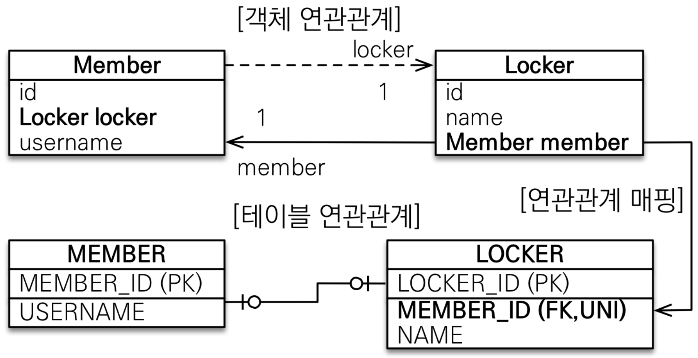
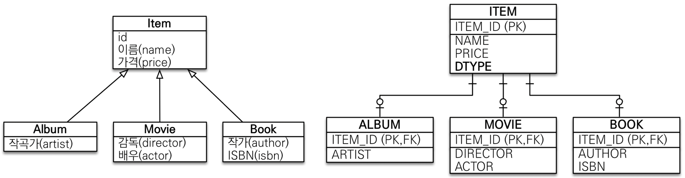
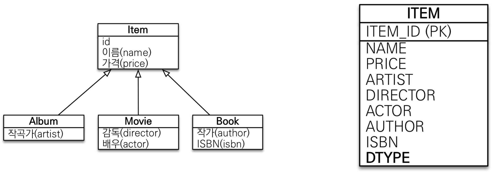
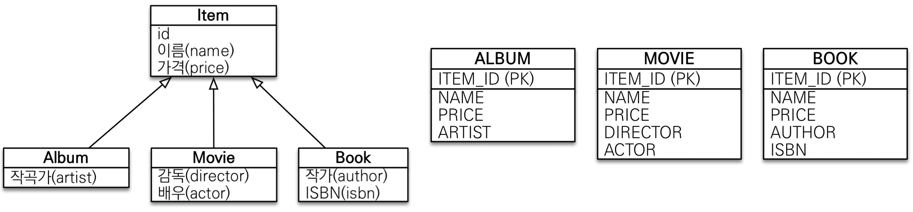
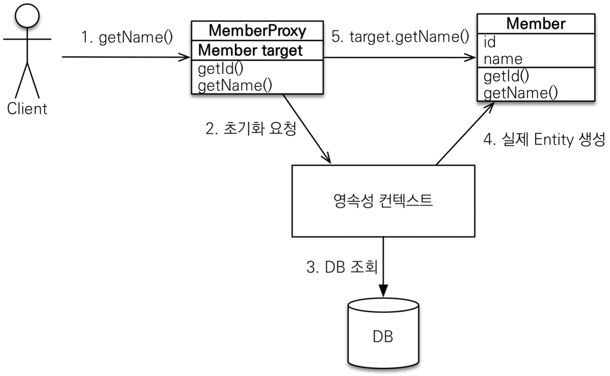

# 김영한님 "자바 ORM 표준 JPA 프로그래밍 - 기본편" 스터디

### 개요

대부분 객체를 관계형 데이터베이스에 관리하고 있다.

SQL 중심적인 개발의 문제점

SQL에 의존적인 개발을 피하기 어렵다.

### 객체와 관계형 데이터베이스의 차이

1. 상속
  1. 객체 상속 관계
  2. Table 슈퍼타입 서브타입 관계
2. 연관관계
  1. 객체는 **참조**를 사용: member.getTeam()
  2. 테이블은 **외래 키**를 사용: JOIN ON M.TEAM_ID = T.TEAM_ID
  3. 계층형 아키텍처 진정한 의미의 **계층 분할**이 어렵다.
3. 데이터 타입
4. 데이터 식별 방법

### JPA

- Java Persistence API
- 자바 진영의 **ORM** 기술 표준

### ORM

- Object-relational mapping(객체 관계 매핑)
- 객체는 객체대로 설계
- 관계형 데이터베이스는 관계형 데이터베이스대로 설계
- ORM 프레임워크가 중간에서 매핑
- 대중적인 언어에는 대부분 ORM 기술이 존재

**JPA는 애플리케이션과 JDBC 사이에서 동작**

### JPA는 표준 명세

- JPA는 인터페이스의 모음
- JPA 2.1 표준 명세를 구현한 3가지 구현체
- 하이버네이트, EclipseLink, DataNucleus

### JPA를 왜 사용해야 하는가?

- SQL 중심적인 개발에서 객체 중심으로 개발
  - 자바 컬렉션에 데이터를 넣었다 뺐다 쓰듯이
- 생산성
  - CRUD가 다 만들어져있다.
  - 저장: jpa.persist
  - 조회: jpa.find
  - 수정: member.setName
  - 삭제: jpa.remove
- 유지보수
  - 필드(컬럼)가 추가, 삭제, 변경되면 JPA가 SQL을 자동으로 변경해준다.
- 패러다임의 불일치 해결
  - 상속
  - 연관관계
  - 객체 그래프 탐색
  - 엔티티 비교
- 성능
  - 1차 캐시와 동일성 보장
  - 트랜잭션을 지원하는 쓰기 지연
  - 지연 로딩
- 데이터 접근 추상화와 벤더 독립성
  - SQL(Structured Query Language, 구조적 질의 언어)을 추상화한 JPQL(Java Persistence Query Language)이라는 객체 지향 쿼리 언어 제공
  - Dialect, 데이터베이스 방언
- 표준

### JPA와 패러다임의 불일치 해결

관계형 데이터베이스와 객체의 패러다임의 불일치를 해결

객체지향에서는 추상화, 상속, 다형성같은 개념이 있지만 데이터베이스에서는 추상화, 상속, 다형성같은 개념들이 없기 때문에 서로가 지향하는 목적이 다르므로 둘의 기능과 표현 방법도 다르다. 이것을 객체와 관계형 데이터베이스의 패러다임 불일치 문제라 한다.

1. JPA와 상속
  1. 상속관계(슈퍼타입, 서브타입 테이블)에 insert 할때 jpa는 한번에 sql이 2번 실행된다.
  2. 조회할때도 조인해서 각 엔티티를 반환
2. JPA와 연관관계
  1. member.getTeam()
3. JPA와 객체 그래프 탐색
  1. 지연 로딩으로..
  2. member.getOrder().getDelivery()
4. JPA와 비교하기
  1. 영속성 컨텍스트에서 관리해서 2번 조회해도 동일한 객체가 리턴된다.
  2. 동일한 트랜잭션에서 조회한 엔티티는 같음을 보장

### JPA의 성능 최적화 기능

1. 1차 캐시와 동일성(identity) 보장
  1. 같은 트랜잭션 안에서는 같은 엔티티를 반환 - 약간의 조회 성능 향상
  2. DB Isolation Level이 Read Commit이어도 애플리케이션에서 Repeatable Read 보장
2. 트랜잭션을 지원하는 쓰기 지연(transactional write-behind)
  1. INSERT
     트랜잭션을 커밋할 때까지 SQL을 모음
     JDBC BATCH SQL 기능을 사용해서 한번에 SQL 전송
  2. UPDATE, DELETE로 인한 로우(ROW)락 시간 최소화
     트랜잭션 커밋 시 UPDATE, DELETE SQL 실행하고, 바로 커밋
3. 지연 로딩(Lazy Loading)
  1. 지연 로딩: 객체가 실제 사용될 때 로딩
  2. 즉시 로딩: JOIN SQL로 한번에 연관된 객체까지 미리 조회

### 데이터베이스 방언 (Dialect)

- JPA는 특정 데이터베이스에 종속 X
- 각각의 데이터베이스가 제공하는 SQL 문법과 함수는 조금씩 다름
  - 가변 문자: MySQL은 VARCHAR, Oracle은 VARCHAR2
  - 문자열을 자르는 함수: SQL 표준은 SUBSTRING(), Oracle은 SUBSTR()
- 페이징: MySQL은 LIMIT , Oracle은 ROWNUM
- 방언: SQL 표준을 지키지 않는 특정 데이터베이스만의 고유한 기능
- **hibernate.dialect** 속성에 지정
  - H2 : org.hibernate.dialect.H2Dialect
  - Oracle 10g : org.hibernate.dialect.Oracle10gDialect
  - MySQL : org.hibernate.dialect.MySQL5InnoDBDialect

### JPQL

- JPA는 SQL(Structured Query Language, 구조적 질의 언어)을 추상화한 JPQL(Java Persistence Query Language)이라는 객체 지향 쿼리 언어 제공
- 테이블이 아닌 **객체를 대상으로 검색하는 객체 지향 쿼리**
- SQL을 추상화해서 특정 데이터베이스 SQL에 의존X
- JPQL을 한마디로 정의하면 객체 지향 SQL

### JPA에서 가장 중요한 2가지

- **객체와 관계형 데이터베이스 매핑하기(Object Relational Mapping)**
- **영속성 컨텍스트**
  - “엔티티를 영구 저장하는 환경”이라는 뜻
  - 영속성 컨텍스트는 논리적인 개념
  - 엔티티 매니저를 통해서 영속성 컨텍스트에 접근
  - EntityManager.persist(entity);

## 영속성 관리

### 엔티티의 생명주기

- **비영속 (new/transient)**
  - 영속성 컨텍스트와 전혀 관계가 없는 **새로운** 상태
- **영속 (managed)**
  - 영속성 컨텍스트에 **관리**되는 상태
- **준영속 (detached)**
  - 영속성 컨텍스트에 저장되었다가 **분리**된 상태
- **삭제 (removed)**
  - **삭제**된 상태

### 영속성 컨텍스트의 이점

- 1차 캐시
  - 한 트랜잭션 안에서만 사용되어서 크게 효과는 없다. 비지니스 로직이 엄청 복잡하면 효과있다.
- 동일성(identity) 보장
  - 1차 캐시로 반복 가능한 읽기(REPEATABLE READ) 등급의 트랜잭션 격리 수준을 데이터베이스가 아닌 애플리케이션 차원에서 제공
- 트랜잭션을 지원하는 쓰기 지연(transactional write-behind)
  - 쓰기 지연 SQL 저장소에 SQL을 저장해두고 flush 시점에 실행되고 나서 commit 한다.
  - hibernate.jdbc.batch_size 설정하면 배치 처리
- 변경 감지(Dirty Checking)
  - 최초에 영속성 컨텍스트에 들어왔을때 1차 캐시에 스냅샷을 찍어두고 트랜잭션이 커밋되는 시점(flush)에 엔티티와 스냅샷을 비교해서 쓰기 지연 SQL 저장소에 update SQL 생성해두고 flush 하고 commit
- 지연 로딩(Lazy Loading)
  - 객체가 실제 사용될 때 query 로 조회

### 플러시

**영속성 컨텍스트의 변경내용을 데이터베이스에 반영
쓰기지연 SQL 저장소의 SQL 들을 실행**

- 플러시 발생
  - 변경 감지(Dirty Checking)
  - 수정된 엔티티 쓰기 지연 SQL 저장소에 등록
  - 쓰기 지연 SQL 저장소의 쿼리를 데이터베이스에 전송(등록, 수정, 삭제 쿼리)
- 영속성 컨텍스트를 플러시하는 방법
  - em.flush() 직접 호출
  - 트랜잭션 커밋 - 플러시 자동 호출
  - JPQL 쿼리 실행 - 플러시 자동 호출
- 영속성 컨텍스트를 비우지 않음
- 영속성 컨텍스트의 변경내용을 데이터베이스에 동기화
- 트랜잭션이라는 작업 단위가 중요 -> 커밋 직전에만 동기화하면 됨

### **준영속 상태**

- 영속 -> 준영속
- 영속 상태의 엔티티가 영속성 컨텍스트에서 분리(detached)
- 영속성 컨텍스트가 제공하는 기능을 사용 못함
- 준영속 상태로 만드는 방법
  - **em.detach(entity)**
    - 특정 엔티티만 준영속 상태로 전환
  - **em.clear()**
    - 영속성 컨텍스트를 완전히 초기화
  - **em.close()**
    - 영속성 컨텍스트를 종료

## 엔티티 매핑

- 객체와 테이블 매핑: **@Entity, @Table**
  - @Entity
    - **@Entity가 붙은 클래스는 JPA가 관리, 엔티티라 한다.**
    - JPA를 사용해서 테이블과 매핑할 클래스는 @Entity 필수
    - 기본 생성자 필수(파라미터가 없는 public 또는 protected 생성자)
    - 사용 불가 - final 클래스, final 필드, enum, interface, inner 클래스
- 필드와 컬럼 매핑: **@Column**
- 기본 키 매핑: **@Id**
- 연관관계 매핑: **@ManyToOne,@JoinColumn**

### ****hibernate.hbm2ddl.auto****

DDL을 애플리케이션 실행 시점에 자동 생성
데이터베이스 방언을 활용해서 데이터베이스에 맞는 적절한

- create
  기존 테이블 삭제 후 다시 생성(DROP + CREATE)
- create-drop
  carete와 같으나 종료시점에 DROP
- update
  변경분만 반영(운영DB에는 사용하면 안됨)
- validate
  엔티티와 테이블이 정상 매핑되었는지만 확인
- none

운영DB에서는 alter나 drop이 실행되지 못하게 계정 자체를 분리하는 것이 좋다.

### 필드와 컬럼 매핑

- @Column - 컬럼 매핑
  - name
  - insertable, updatable
  - nullable
  - unique - UK_xxx 제약조건 이름이 임의의 값으로 생성되서 잘쓰지 않고 @Table(uniqueConstraints)를 쓴다.
  - columnDefinition
  - length
  - precision, scale - BigDeciaml, BigInteger 에서 사용. double, float는 안된다.
- @Temporal - 날짜 타입 매핑
  - LocalDate, LocalDateTime 을 사용할 때는 생략 가능
  - @Temporal(TemporalType.TIMESTAMP)
- @Enumerated - enum 타입 매핑
  - value
    - EnumType.ORDINAL - enum의 index를 데이터베이스에 저장. 기본값. 쓰지 마라. 위험하다.
    - EnumType.STRING - enum의 이름을 데이터베이스에 저장
- @Lob - BLOB, CLOB 매핑
  - 매핑하는 필드 타입이 문자면 CLOB 매핑, 나머지는 BLOB 매핑
    - CLOB: String, char[], java.sql.CLOB
    - BLOB: byte[], java.sql. BLOB
- @Transient - 특정 필드를 컬럼에 매핑하지 않음(매핑 무시)

### 기본 키 매핑

- @Id
- @GeneratedValue
- 직접 할당
  - @Id 만 사용
- 자동 생성
  - @GeneratedValue
  - IDENTITY: 데이터베이스에 위임, MYSQL
    - 주로 MySQL, PostgreSQL, SQL Server, DB2에서 사용(예: MySQL의 AUTO_ INCREMENT)
    - JPA는 보통 트랜잭션 커밋 시점에 INSERT SQL 실행
    - AUTO_ INCREMENT는 데이터베이스에 INSERT SQL을 실행
    - IDENTITY 전략은 em.persist() 시점에 즉시 INSERT SQL 실행하고 DB에서 식별자를 조회
    - 즉 IDENTITY를 사용하면 em.persist() 할때 영속성 컨텍스트에 넣어야 하기때문에 즉시 insert sql을 실행해서 배치 처리가 안된다.(flush 시점에 하지 않는다.)
  - SEQUENCE: 데이터베이스 시퀀스 오브젝트 사용, ORACLE
    - @SequenceGenerator 필요
    - 데이터베이스 시퀀스는 유일한 값을 순서대로 생성하는 특별한 데이터베이스 오브젝트(예: 오라클 시퀀스)
    - 오라클, PostgreSQL, DB2, H2 데이터베이스에서 사용

    ```java
    @Entity
    @SequenceGenerator(
        name = “MEMBER_SEQ_GENERATOR",
        sequenceName = “MEMBER_SEQ", //매핑할 데이터베이스 시퀀스 이름
        initialValue = 1, allocationSize = 1)
    public class Member {
        @Id
        @GeneratedValue(strategy = GenerationType.SEQUENCE, generator = "MEMBER_SEQ_GENERATOR")
        private Long id;
    ```

    - **주의: allocationSize
      시퀀스 한 번 호출에 증가하는 수(성능 최적화에 사용됨**)
      **기본값 = 50, 데이터베이스 시퀀스 값이 하나씩 증가하도록 설정되어 있으면 이 값을 반드시 1로 설정해야 한다**
  - TABLE: 키 생성용 테이블 사용, 모든 DB에서 사용
    - @TableGenerator 필요
    - 키 생성 전용 테이블을 하나 만들어서 데이터베이스 시퀀스를 흉내내는 전략
    - 장점: 모든 데이터베이스에 적용 가능
    - 단점: 성능

    ```java
    @Entity
    @TableGenerator(
        name = "MEMBER_SEQ_GENERATOR",
        table = "MY_SEQUENCES",
        pkColumnValue = "MEMBER_SEQ", 
        allocationSize = 1)
    public class Member {
        @Id
        @GeneratedValue(strategy = GenerationType.TABLE,generator = "MEMBER_SEQ_GENERATOR")
        private Long id;
    ```

  - AUTO: 방언에 따라 자동 지정, 기본값

### 권장하는 식별자 전략

- **기본 키 제약 조건**: null 아님, 유일, **변하면 안된다.**
- 미래까지 이 조건을 만족하는 자연키(주민등록번호 등)는 찾기 어렵다. 대리키(대체키)를 사용하자.(비지니스와 상관없는 제네레이트키, 랜덤키를 사용하자)
- 예를 들어 주민등록번호도 기본 키로 적절하기 않다.
- **권장: Long형 + 대체키 + 키 생성전략 사용**
  - auto_increment
  - 시퀀스 오브젝트
  - uuid
  - 랜덤키

### **데이터 중심 설계의 문제점**

- 현재 방식은 객체 설계를 테이블 설계에 맞춘 방식
- 테이블의 외래키를 객체에 그대로 가져옴
- 객체 그래프 탐색이 불가능
- 참조가 없으므로 UML도 잘못됨

## 연관관계

‘객체지향 설계의 목표는 자율적인 객체들의 **협력 공동체**를 만드는 것이다.’ **– 조영호(객체지향의 사실과 오해)**

- **객체를 테이블에 맞추어 데이터 중심으로 모델링하면, 협력 관계를 만들 수 없다.**
  - **테이블은 외래 키로 조인을 사용해서 연관된 테이블을 찾는다.**
  - 객체는 참조를 사용해서 연관된 객체를 찾는다.
  - **테이블과 객체 사이에는 이런 큰 간격이 있다.**

### 단방향 연관관계

```java
@ManyToOne
@JoinColumn(name = “team_id”)
private Team team;
```

### 양방향 연관관계와 연관관계의 주인

- **객체와 테이블간에 연관관계를 맺는 차이를 이해해야 한다.**
  - **객체 연관관계 = 2개**
    - 회원 -> 팀 연관관계 1개(단방향)
    - 팀 -> 회원 연관관계 1개(단방향)
  - **테이블 연관관계 = 1개**
    - 회원 <-> 팀의 연관관계 1개(양방향)
- 객체의 양방향 관계
  - 객체의 **양방향 관계는 사실 양방향 관계가 아니라 서로 다른 단뱡향 관계 2개다.**
  - 객체를 양방향으로 참조하려면 **단방향 연관관계를 2개** 만들어야 한다.
- 테이블의 양방향 연관관계
  - 테이블은 **외래 키 하나**로 두 테이블의 연관관계를 관리
  - MEMBER.TEAM_ID 외래 키 하나로 양방향 연관관계 가짐(양쪽으로 조인할 수 있다.)
- **둘 중 하나로 외래 키를 관리해야 한다.**

### **연관관계의 주인(Owner)**

**양방향 매핑 규칙**

- 객체의 두 관계중 하나를 연관관계의 주인으로 지정
- **연관관계의 주인만이 외래 키를 관리(등록, 수정)**
- **주인이 아닌쪽은 읽기만 가능**
  - 주인은 mappedBy 속성 사용X
  - 주인이 아니면 mappedBy 속성으로 주인 지정

**누구를 주인으로?**

- 외래 키가 있는 있는 곳을 주인으로 정해라
- 여기서는 **Member.team**이 연관관계의 주인

**양방향 매핑시 연관관계의 주인에 값을 입력해야 한다.
(순수한 객체 관계를 고려하면 항상 양쪽다 값을 입력해야 한다.)**

- ****순수 객체 상태를 고려해서 항상 양쪽에 값을 설정하자****
- 연관관계 편의 메소드를 생성하자
  - 예를 들면 주인에게 설정하는 메서드에서 반대쪽을 같이 설정해준다.
- 양방향 매핑시에 무한 루프를 조심하자
  - 예: toString(), lombok, JSON 생성 라이브러리

### 양방향 매핑 정리

- **단방향 매핑만으로도 이미 연관관계 매핑은 완료**
- 양방향 매핑은 반대 방향으로 조회(객체 그래프 탐색) 기능이 추가된 것 뿐
- JPQL에서 역방향으로 탐색할 일이 많음
- 단방향 매핑을 잘 하고 양방향은 필요할 때 추가해도 됨(테이블에 영향을 주지 않음)

### 연관관계의 주인을 정하는 기준

- 비즈니스 로직을 기준으로 연관관계의 주인을 선택하면 안됨
- **연관관계의 주인은 외래 키의 위치를 기준으로 정해야함**

### 연관관계 매핑시 고려사항 3가지

- 다중성
  - 다대일: @ManyToOne
  - 일대다: @OneToMany
  - 일대일: @OneToOne
  - 다대다: @ManyToMany - 실무에서 쓰면 안된다.
- 단방향, 양방향
  - **테이블**
    - 외래 키 하나로 양쪽 조인 가능
    - 사실 방향이라는 개념이 없음
  - **객체**
    - 참조용 필드가 있는 쪽으로만 참조 가능
    - 한쪽만 참조하면 단방향
    - 양쪽이 서로 참조하면 양방향
- 연관관계의 주인
  - 테이블은 외래 키 하나로 두 테이블이 연관관계를 맺음
  - 객체 양방향 관계는 A->B, B->A 처럼 **참조가 2군데**
  - 객체 양방향 관계는 참조가 2군데 있음. 둘중 테이블의 외래 키를 관리할 곳을 지정해야함
  - 연관관계의 주인: 외래 키를 관리하는 참조
  - 주인의 반대편: 외래 키에 영향을 주지 않음, 단순 조회만 가능
- 다대일 - 가장 많이 사용

  ```java
  // 단방향
  public class Member {
      @ManyToOne // 다대일
      @JoinColumn(name = "team_id") // 연관관계 주인
      private Team team;
  
  // 양방향
  public class Team {
      @OneToMany(mappedBy = "team") // 일대다, members의 team을 연관관계 주인으로 지정
      private List<Member> members = new ArrayList<>();
  ```

- 일대다 - 권장하지 않음
  - 일대다 단방향은 일대다(1:N)에서 **일(1)이 연관관계의 주인**
  - 테이블 일대다 관계는 항상 **다(N) 쪽에 외래 키가 있음**
  - 객체와 테이블의 차이 때문에 반대편 테이블의 외래 키를 관리하는 특이한 구조
  - @JoinColumn을 꼭 사용해야 함. 그렇지 않으면 조인 테이블 방식을 사용함(중간에 테이블을 하나 추가함)
  - 일대다 단방향 매핑의 단점
    - 엔티티가 관리하는 외래 키가 다른 테이블에 있음
    - 연관관계 관리를 위해 추가로 UPDATE SQL 실행
      - 개발을 하다 보면 B를 만졌는데 A도 update sql문이 나가니 헷갈린다.
        <details>
        <summary>소스 보기</summary>
        <div markdown="1">

        ```java
        Member member1 = Member.builder()
                .name("member1")
                .build();
        Member member2 = Member.builder()
                .name("member2")
                .build();
        memberRepository.save(member1);
        memberRepository.save(member2);
        
        Team team = new Team("team");
        team.addMember(member1);
        team.addMember(member2);
        teamRepository.save(team);
        
        // query
        insert into member
        insert into member
        insert into team
        update member set team_id
        update member set team_id
        ```
        
        </div>
        </details>

    - 일대다 단방향 매핑보다는 **다대일 양방향 매핑을 사용**하자
  - 일대다 양방향
    - 이런 매핑은 공식적으로 존재X
    - @JoinColumn(**insertable=false, updatable=false**)
    - **읽기 전용 필드**를 사용해서 양방향 처럼 사용하는 방법
    - **다대일 양방향을 사용하자**

      ```java
      public class Team {
          @OneToMany
          @JoinColumn(name = "team_id") // 연관관계 주인
          private List<Member> members = new ArrayList<>();
      
      // 단방향
      public class Member {
          // team 정보 없음
      
      // 양방향
      public class Member {
          @ManyToOne
          @JoinColumn(name = "team_id", **insertable=false, updatable=false**)
          private Team team;
      ```

- 일대일
  - 주 테이블이나 대상 테이블 중에 외래 키 선택 가능
  - 외래 키에 데이터베이스 유니크(UNI) 제약조건 추가된 것이 1:1
  - 외래 키가 locker에 있을 때 member에서 locker 관리 불가능. 지원하지 않는다.

  ```java
  public class Member {
    @OneToOne
    @JoinColumn(name = "locker_id") // 연관관계 주인
    private Locker locker;
  
  // 단방향
  public class Locker {
    // member 정보 없음
  
  // 양방향
  public class Locker {
    @OneToOne(mappedBy = "locker")
    private Member member;
  ```

  - 주 테이블에 외래 키
    - 주 객체가 대상 객체의 참조를 가지는 것 처럼 주 테이블에 외래 키를 두고 대상 테이블을 찾음
    - 객체지향 개발자 선호
    - JPA 매핑 편리
    - 장점: 주 테이블만 조회해도 대상 테이블에 데이터가 있는지 확인 가능
    - 단점: 값이 없으면 외래 키에 null 허용
  - 대상 테이블에 외래 키
    - 대상 테이블에 외래 키가 존재
    - 전통적인 데이터베이스 개발자 선호
    - 장점: 주 테이블과 대상 테이블을 일대일에서 일대다 관계로 변경할 때 테이블 구조 유지
    - 단점: 프록시 기능의 한계로 **지연 로딩으로 설정해도 항상 즉시 로딩됨**(프록시는 뒤에서 설명)
      - bytecode instrumentation(이거 사용하려면 설정이 어려움, 자바 옵션 넣고 등등 저도 안해봄)
      - 프록시: 지연 로딩으로 설정했을 때, 연관된 엔티티가 있으면 프록시 객체가 대신 들어가면 되지만, 연관된 엔티티가 없으면 null이 들어가야 한다.
      - 주 테이블에 외래키가 있으면 값이 있는지 없는지 주 테이블을 로딩하는 시점에 외래 키 컬럼을 보고 바로 확인할 수 있다. 그래서 값이 있으면 연관관계에 프록시를 넣어주고, 없으면 null을 설정한다.
      - Member 엔티티를 조회할때 locker 필드에 값이 있는지 없는지 확인하려면 LOCKER 테이블을 뒤져서 있는지 없는지 확인하기 위해 쿼리가 나간다. 어차피 쿼리가 나가기때문에 프록시가 필요가 없다. 값이 있으면 조회한 값을 넣어주고 없으면 null을 넣어준다.

      

- 다대다
  - 관계형 데이터베이스는 정규화된 테이블 2개로 다대다 관계를 표현할 수 없음
  - 연결 테이블을 추가해서 일대다, 다대일 관계로 풀어내야함
  - 객체는 컬렉션을 사용해서 객체 2개로 다대다 관계 가능
  - **@ManyToMany** 사용
  - **@JoinTable**로 연결 테이블 지정
  - **편리해 보이지만 실무에서 사용X**
  - 연결 테이블이 단순히 연결만 하고 끝나지 않음. 주문시간, 수량 같은 데이터가 들어올 수 있음
  - **다대다 한계 극복**
    - ****연결 테이블용 엔티티 추가(연결 테이블을 엔티티로 승격)****
    - ****@ManyToMany -> @OneToMany, @ManyToOne****

### 상속관계 매핑

- 관계형 데이터베이스는 상속 관계 X
- 슈퍼타입 서브타입 관계라는 모델링 기법이 객체 상속과 유사
- 상속관계 매핑: 객체의 상속과 구조와 DB의 슈퍼타입 서브타입 관계를 매핑
- 슈퍼타입 서브타입 논리 모델을 실제 물리 모델로 구현하는 방법
  - 각각 테이블로 변환 -> 조인 전략
  - 통합 테이블로 변환 -> 단일 테이블 전략
  - 서브타입 테이블로 변환 -> 구현 클래스마다 테이블 전략
- 주요 어노테이션
  - @Inheritance(strategy=InheritanceType.XXX)
    부모 클래스에 설정
    - **JOINED**: 조인 전략
      

      - 장점
        - 테이블 정규화
        - **외래 키 참조 무결성 제약조건 활용가능**
        - **저장공간 효율화**
      - 단점
        - 조회시 조인을 많이 사용, 성능저하
        - 조회 쿼리가 복잡함
        - 데이터 저장시 INSERT SQL 2번 호출
    - **SINGLE_TABLE**: 단일 테이블 전략
      

      - 장점
        - 조인이 필요 없으므로 일반적으로 조회 성능이 빠름
        - 조회 쿼리가 단순함
      - 단점
        - **자식 엔티티가 매핑한 컬럼은 모두 null 허용**
        - 단일 테이블에 모든 것을 저장하므로 테이블이 커질 수 있다. 상황에 따라서 조회 성능이 오히려 느려질 수 있다.
    - **TABLE_PER_CLASS**: 구현 클래스마다 테이블 전략
      

      - ****이 전략은 데이터베이스 설계자와 ORM 전문가 둘 다 추천X****
      - 장점
        - **서브 타입을 명확하게 구분해서 처리할 때 효과적**
        - not null 제약조건 사용 가능
      - 단점
        - 여러 자식 테이블을 함께 조회할 때 성능이 느림(UNION SQL 필요)
        - 자식 테이블을 통합해서 쿼리하기 어려움
  - @DiscriminatorColumn(name=“DTYPE”)
    - 부모 클래스에 넣어주면 슈퍼타입에 자식 타입을 식별할 수 있는 컬럼이 생성된다.
    - 슈퍼타입 테이블 데이터만 보고 자식 타입을 식별할 수 있게 해준다.
  - @DiscriminatorValue(“XXX”)
    - @DiscriminatorColumn 에 들어갈 자식의 값
    - 기본 값은 자식 엔티티의 이름(클래스 명)
- `데이터가 많아지면 조인 전략으로는 관리하기 어렵다. 테이블을 단순하게 유지하는 것이 좋다.`

### **@MappedSuperclass**

**공통 매핑 정보가 필요할 때 사용**

- 상속관계 매핑X
- 엔티티X, 테이블과 매핑X
- 부모 클래스를 상속 받는 **자식 클래스에 매핑 정보만 제공**
- 조회, 검색 불가(**em.find(BaseEntity) 불가**)
- 직접 생성해서 사용할 일이 없으므로 **추상 클래스 권장**
- 테이블과 관계 없고, 단순히 엔티티가 공통으로 사용하는 매핑 정보를 모으는 역할
- 주로 등록일, 수정일, 등록자, 수정자 같은 전체 엔티티에서 공통으로 적용하는 정보를 모을 때 사용
- 참고: @Entity 클래스는 엔티티나 @MappedSuperclass로 지정한 클래스만 상속 가능

### @Embeddable 과 @MappedSuperclass

**상속**을 사용하는 것(@MappedSuperclass)과 **위임**을 사용하는 것(@Embeddable)의 차이

상속의 문제

- 부모 타입과 자식 타입이 강한 결합성을 가짐으로써 캡슐화가 깨지고, 속한 객체들이 변경의 여파를 받게 된다.
- 한 객체에서 정의된 상태나 행위에 대해서 관리하거나 확인해야 할 포인트(class)가 늘어난다.
- 자식 타입에서 메서드를 재정의하는 경우에 잘못된 이해로 특정 로직만 추가하고 부모 타입의 메서드를 호출하고 있을 때 오동작할 수 있다.부모 타입의 메서드가 변경되어서 자식 타입의 메서드가 깨지거나 오동작할 수 있다.

따라서 객체지향의 일반적인 법칙을 따르면 **상속**보다는 **위임(조합)**이 더 좋기 때문에 **위임**을 사용한다.

하지만 **등록일, 수정일, 등록한 사람, 수정한 사람**과 같이 운영상의 이유를 포함하는 컬럼을 공통으로 사용할 때는 **상속**을 사용하는게 더욱 편리하다.

**편리함**과 **직관성**

```java
// 상속
select u from User u where u.createdDate > ?

// 위임
select u from User u where u.timestamped.createdDate > ?
```

## 프록시

- 프록시 기초
  - em.find() vs em.**getReference()**
  - em.find(): 데이터베이스를 통해서 실제 엔티티 객체 조회
  - em.getReference(): **데이터베이스 조회를 미루는 가짜(프록시) 엔티티 객체 조회**
- 프록시 특징
  - 실제 클래스를 상속 받아서 만들어짐
  - 실제 클래스와 겉 모양이 같다.
  - 사용하는 입장에서는 진짜 객체인지 프록시 객체인지 구분하지 않고 사용하면 됨(이론상)
  - 프록시 객체는 실제 객체의 참조(target)를 보관
  - 프록시 객체를 호출하면 프록시 객체는 실제 객체의 메서드 호출

    

  - 프록시 객체는 처음 사용할 때 한 번만 초기화
  - 프록시 객체를 초기화 할 때, 프록시 객체가 실제 엔티티로 바뀌는 것은 아님, 초기화되면 프록시 객체를 통해서 실제 엔티티에 접근 가능
  - 프록시 객체는 원본 엔티티를 상속받음, 따라서 타입 체크시 주의해야함 (== 비교 실패, 대신 instance of 사용)
  - 영속성 컨텍스트에 찾는 엔티티가 이미 있으면 em.**getReference()**를 호출해도 실제 엔티티 반환.
    이 반대 상황도 마찬가지
  - 영속성 컨텍스트의 도움을 받을 수 없는 준영속 상태일 때, 프록시를 초기화(프록시 객체를 최초 사용)하면 문제 발생
    (하이버네이트는 org.hibernate.LazyInitializationException: could not initialize proxy 예외를 터트림)
- 프록시 확인
  - **프록시 인스턴스의 초기화 여부 확인**
    PersistenceUnitUtil.isLoaded(Object entity)
  - 프록시 클래스 확인 방법
    entity.getClass().getName() 출력(..javasist.. or HibernateProxy…)
  - **프록시 강제 초기화**
    org.hibernate.Hibernate.initialize(entity);
  - 참고: JPA 표준은 강제 초기화 없음
    강제 호출: **member.getName()**

### 즉시 로딩과 지연 로딩

- 지연 로딩(LAZY)
  - **실제 참조 객체를 사용하는 시점에 초기화(DB 조회)**

  ```java
  @ManyToOne(fetch = FetchType.LAZY)
  @JoinColumn(name = "team_id")
  private Team team;
  ```

- 즉시 로딩(EAGER)
  - **JPA 구현체는 가능하면 조인을 사용해서 SQL 한번에 함께 조회**

  ```java
  @ManyToOne(fetch = FetchType.EAGER)
  @JoinColumn(name = "team_id")
  private Team team;
  ```

- **가급적 지연 로딩만 사용(특히 실무에서)**
- 즉시 로딩을 적용하면 예상하지 못한 SQL이 발생(의도치 않은 조인)
- **즉시 로딩은 JPQL에서 N+1 문제를 일으킨다.**
  - em.createQuery("select m from Member m", Member.class) 이 실행되면 일단 SQL이 실행되고 엔티티에 매핑할때 EAGER 인 매핑 엔티티(@ManyToOne Team)가 있으면 즉시 조회를 한다.
  - 지연 로딩이면 나가지 않는다. 물론 Team을 사용하면 N번 쿼리가 나간다.
  - 해결 방법
    1. JPQL fetch 조인
      1. 엔티티에 지연 로딩으로 설정되어 있어도 조인되서 모두 조회된다. 1번
      2. @xToOne 인 경우에만 원하는 결과가 나온다. @xToMany 인 경우 동일한 데이터가 N건 조회된다.

      ```java
      em.createQuery("select m from Member m join fetch m.team", Member.class)
      ```

    2. @EntityGraph
      1. 연관된 엔티티들을 SQL 한번에 조회하는 방법
      2. member → team은 지연로딩 관계이다. 따라서 다음과 같이 team의 데이터를 조회할 때 마다 쿼리가 실행된다. (N+1 문제 발생)
      3. @EntityGraph(attributePaths = {"team"})
      4. 사실상 페치 조인(FETCH JOIN)의 간편 버전
    3. @BatchSize, hibernate.default_batch_fetch_size 의 값을 1000이하의 적절한 값으로
      1. 1 + (n / size)번 나간다. 보통 1 + 1 = 2번 나간다.
- **@ManyToOne, @OneToOne은 기본이 즉시 로딩 → LAZY로 설정**
- @OneToMany, @ManyToMany는 기본이 지연 로딩
- **모든 연관관계에 지연 로딩을 사용해라!**
- **실무에서 즉시 로딩을 사용하지 마라!**
  - 자주 함께 사용되면 즉시 로딩을 사용
- **JPQL fetch 조인이나, 엔티티 그래프 기능을 사용해라!**

### 영속성 전이: CASCADE

**특정 엔티티를 영속 상태로 만들 때 연관된 엔티티도 함께 영속 상태로 만들고 싶을 때**

**예: 부모 엔티티를 저장할 때 자식 엔티티도 함께 저장.**

```java
@OneToMany(mappedBy="parent", cascade=CascadeType.PERSIST)
```

영속성 전이는 연관관계를 매핑하는 것과 아무 관련이 없음

엔티티를 영속화할 때 연관된 엔티티도 함께 영속화하는 편리함을 제공할 뿐

- 종류
  - **ALL: 모두 적용**
  - **PERSIST: 영속**
  - **REMOVE: 삭제**
  - MERGE: 병합
  - REFRESH: REFRESH
  - DETACH: DETACH

### 고아 객체

- **고아 객체 제거: 부모 엔티티와 연관관계가 끊어진 자식 엔티티를 자동으로 삭제**
- **orphanRemoval = true**
- Parent parent1 = em.find(Parent.class, id);
  parent1.getChildren().remove(0); // 자식 엔티티를 컬렉션에서 제거하면 delete sql 실행됨
- 주의
  - 참조가 제거된 엔티티는 다른 곳에서 참조하지 않는 고아 객체로 보고 삭제하는 기능
  - **참조하는 곳이 하나일 때 사용해야함!**
  - **특정 엔티티가 개인 소유할 때 사용**
  - @OneToOne, @OneToMany만 가능
  - **참고: 개념적으로 부모를 제거하면 자식은 고아가 된다. 따라서 고아 객체 제거 기능을 활성화 하면, 부모를 제거할 때 자식도 함께 제거된다.
    orphanRemoval 가 false 인 경우에도 CascadeType.REMOVE 나 ALL 이면 자식을 삭제하고 부모를 삭제한다.**

### **영속성 전이 + 고아 객체, 생명주기**

- **CascadeType.ALL + orphanRemoval=true**
- 스스로 생명주기를 관리하는 엔티티는 em.persist()로 영속화, em.remove()로 제거
- 두 옵션을 모두 활성화 하면 부모 엔티티를 통해서 자식의 생명 주기를 관리할 수 있음
- 도메인 주도 설계(DDD)의 Aggregate Root(루트 엔티티의 리파지토리만 만들어서 루트 엔티티를 통해서 자식 엔티티의 생명주기를 관리한다.)개념을 구현할 때 유용
  - 애그리거트: 관련 객체를 하나로 묶은 군집
  - 루트 엔티티: 애그리거트에 속한 객체들을 관리하는 엔티티
  - 애그리거트에 속한 객체는 유사하거나 동일한 라이프사이클을 갖는다.

### 글로벌 페치 전략 설정

- 모든 연관관계를 지연 로딩으로
- @ManyToOne, @OneToOne은 기본이 즉시 로딩이므로 지연 로딩으로 변경

### 영속성 전이 설정

- **Order -> Delivery**를 영속성 전이 ALL 설정
- **Order -> OrderItem**을 영속성 전이 ALL 설정

## 값 타입

### **JPA의 데이터 타입 분류**

- **엔티티 타입**
  - @Entity로 정의하는 객체
  - 데이터가 변해도 식별자로 지속해서 추적 가능
  - 예)회원 엔티티의 키나 나이 값을 변경해도 식별자로 인식 가능
- **값 타입**
  - int, Integer, String처럼 단순히 값으로 사용하는 자바 기본 타입이나 객체
  - 식별자가 없고 값만 있으므로 변경시 추적 불가
  - 예) 숫자 100을 200으로 변경하면 완전히 다른 값으로 대체
  - 생명주기를 엔티티의 의존
  - 값 타입은 공유하면X

### 값 타입 분류

- **기본값 타입**
  - 자바 기본 타입(int, double)
  - 래퍼 클래스(Integer, Long)
  - String
- **임베디드 타입**(embedded type, 복합 값 타입)
- **컬렉션 값 타입**(collection value type)

### 임베디드 타입

- 새로운 값 타입을 직접 정의할 수 있음
- JPA는 임베디드 타입(embedded type)이라 함
- 주로 기본 값 타입을 모아서 만들어서 복합 값 타입이라고도 함
- 사용법
  - @Embeddable: 값 타입을 정의하는 곳에 표시
  - @Embedded: 값 타입을 사용하는 곳에 표시
  - 기본 생성자 필수
- 장점
  - 재사용
  - 높은 응집도
  - Period.isWork()처럼 해당 값 타입만 사용하는 의미 있는 메소드를 만들 수 있음
  - 임베디드 타입을 포함한 모든 값 타입은, 값 타입을 소유한 엔티티에 생명주기를 의존함
- 객체와 테이블을 아주 세밀하게(find-grained) 매핑하는 것이 가능
- 잘 설계한 ORM 애플리케이션은 매핑한 테이블의 수보다 클래스의 수가 더 많음
- @AttributeOverrides, @AttributeOverride를 사용해서 컬럼명 속성을 재정의

```java
// 컬럼명이 중복되면
@AttributeOverrides({
    @AttributeOverride(name = "city", column = @Column(name = "home_city")),
    @AttributeOverride(name = "street", column = @Column(name = "home_street")),
    @AttributeOverride(name = "zipcode", column = @Column(name = "home_zipcode"))
})
private Address homeAddress;
```

### 값 타입과 불변 객체

임베디드 타입 같은 값 타입을 여러 엔티티에서 공유하면 위험함

부작용(side effect) 발생

값 타입의 실제 인스턴스인 값을 공유하는 것은 위험

대신 값(인스턴스)를 복사해서 사용

항상 값을 복사해서 사용하면 공유 참조로 인해 발생하는 부작용을 피할 수 있다.

- 불변 객체
  - 객체 타입을 수정할 수 없게 만들면 **부작용을 원천 차단**
  - **값 타입은 불변 객체(immutable object)로 설계해야함**
  - **불변 객체: 생성 시점 이후 절대 값을 변경할 수 없는 객체**
  - 생성자로만 값을 설정하고 수정자(Setter)를 만들지 않으면 됨
  - 참고: Integer, String은 자바가 제공하는 대표적인 불변 객체
- 값 타입: 인스턴스가 달라도 그 안에 값이 같으면 같은 것으로 봐야함
- 값 타입의 비교
  - **동일성(identity) 비교**: 인스턴스의 참조 값을 비교, == 사용
  - **동등성(equivalence) 비교**: 인스턴스의 값을 비교, equals() 사용
  - 값 타입은 a.equals(b)를 사용해서 동등성 비교를 해야 함
  - 값 타입의 equals() 메소드를 적절하게 재정의(주로 모든 필드 사용)

### 값 타입 컬렉션

- 값 타입을 하나 이상 저장할 때 사용
- @ElementCollection, @CollectionTable 사용
- 데이터베이스는 컬렉션을 같은 테이블에 저장할 수 없다.
- 컬렉션을 저장하기 위한 별도의 테이블이 필요함

```java
@ElementCollection
@CollectionTable(name = "favorite_food", joinColumns = {@JoinColumn(name = "member_id")})
@Column(name = "food_name")
private Set<String> favoriteFoods = new HashSet<>();

@ElementCollection
@CollectionTable(name = "address", joinColumns = {@JoinColumn(name = "member_id")})
private List<Address> addressHistory = new ArrayList<>();
```

- 값 타입 컬렉션도 지연 로딩 전략 사용
- 참고: 값 타입 컬렉션은 영속성 전이(Cascade) + 고아 객체 제거 기능을 필수로 가진다고 볼 수 있다.
- 값 타입 컬렉션의 제약사항
  - 값 타입은 엔티티와 다르게 식별자 개념이 없다.
    - `@OrderColumn` 으로 식별자를 만들어 줄 수 있다.
      - 조인 컬럼과 @OrderColumn에 설정해준 컬럼을 복합키로 기본키를 생성한다.
      - 순번과 같이 자동으로 값이 들어간다.
    - 근데 @OrderColumn을 쓰면 빈자리는 null로 나온다?
      - 0, 1, 2, 3 이 있을 때 2를 지우면 0, 1, null, 3 으로 나온다?
  - 값은 변경하면 추적이 어렵다.
  - 값 타입 컬렉션에 변경 사항이 발생하면, 주인 엔티티와 연관된 모든 데이터를 삭제하고, 값 타입 컬렉션에 있는 현재 값을 모두 다시 저장한다.
  - 값 타입 컬렉션을 매핑하는 테이블은 모든 컬럼을 묶어서 기본 키를 구성해야 함: **null 입력X, 중복 저장X**
    - 기본적으로 PK가 생성되지 않는다.

### 값 타입 컬렉션 대안

- 실무에서는 상황에 따라 **값 타입 컬렉션 대신에 일대다 관계를 고려**
- 일대다 관계를 위한 엔티티를 만들고, 여기에서 값 타입을 사용
- 영속성 전이(Cascade) + 고아 객체 제거를 사용해서 값 타입 컬렉션 처럼 사용
- 아래 처럼 일대다 단방향으로
  - 일대다 단방향의 단점이 있으므로 다대일 양방향 고려.

```java
@Entity
public class MemberAddress {
    @Id @GeneratedValue
    private Long id;
    
    private Address address;
}

// 연관 관계 매핑
@OneToMany(cascade = CascadeType.ALL, orphanRemoval = true)
@JoinColumn(name = "member_id")
private List<MemberAddress> memberAddresses = new ArrayList<>();
```

정말 단순한 값만 있는 경우에만 값 타입 컬렉션을 사용하고, 아니면 엔티티를 사용

### **JPA는 다양한 쿼리 방법을 지원**

- **JPQL**
- JPA Criteria
- **QueryDSL**
- 네이티브 SQL
- JDBC API 직접 사용, MyBatis, SpringJdbcTemplate 함께 사용

## 객체지향 쿼리 언어(JPQL, **Java Persistence Query Language**)

개요

- JPA를 사용하면 엔티티 객체를 중심으로 개발
- 문제는 검색 쿼리
- 검색을 할 때도 **테이블이 아닌 엔티티 객체를 대상으로 검색**
- 모든 DB 데이터를 객체로 변환해서 검색하는 것은 불가능
- 애플리케이션이 필요한 데이터만 DB에서 불러오려면 결국 검색 조건이 포함된 SQL이 필요

**JPQL**

- JPA는 SQL을 추상화한 JPQL이라는 객체 지향 쿼리 언어 제공
- SQL과 문법 유사, SELECT, FROM, WHERE, GROUP BY, HAVING, JOIN 지원
- JPQL은 엔티티 객체를 대상으로 쿼리
- SQL은 데이터베이스 테이블을 대상으로 쿼리
- 테이블이 아닌 객체를 대상으로 검색하는 객체 지향 쿼리
- SQL을 추상화해서 특정 데이터베이스 SQL에 의존X
- JPQL을 한마디로 정의하면 객체 지향 SQL

### Criteria

- 문자가 아닌 자바코드로 JPQL을 작성할 수 있음
- JPQL 빌더 역할
- JPA 공식 기능
- 단점: 너무 복잡하고 실용성이 없다. 보통 실무에서 사용하지 않는다.
- ****QueryDSL 사용 권장****

```java
//Criteria 사용 준비
CriteriaBuilder cb = em.getCriteriaBuilder();
CriteriaQuery<Member> query = cb.createQuery(Member.class);

//루트 클래스 (조회를 시작할 클래스)
Root<Member> m = query.from(Member.class);

//쿼리 생성
CriteriaQuery<Member> cq =  query.select(m).where(cb.equal(m.get("username"), “kim”));
List<Member> resultList = em.createQuery(cq).getResultList();
```

### QueryDSL

- 문자가 아닌 자바코드로 JPQL을 작성할 수 있음
- JPQL 빌더 역할
- 컴파일 시점에 문법 오류를 찾을 수 있음
- 동적쿼리 작성 편리함
- **단순하고 쉬움**

```java
JPAFactoryQuery query = new JPAQueryFactory(em);
QMember m = QMember.member;

List<Member> list = query.selectFrom(m)
        .where(m.age.gt(18))
        .orderBy(m.name.desc())
        .fetch();
```

### 네이티브 SQL

- JPA가 제공하는 SQL을 직접 사용하는 기능
- JPQL로 해결할 수 없는 특정 데이터베이스에 의존적인 기능
  - 예) 오라클 CONNECT BY, 특정 DB만 사용하는 SQL 힌트

```java
List<Member> resultList = em.createNativeQuery(sql, Member.class).getResultList();
```

### JDBC 직접 사용, SpringJdbcTemplate 등

- JPA를 사용하면서 JDBC 커넥션을 직접 사용하거나, 스프링 JdbcTemplate, 마이바티스등을 함께 사용 가능
- 단 영속성 컨텍스트를 적절한 시점에 강제로 플러시 필요
- 예) JPA를 우회해서 SQL을 실행하기 직전에 영속성 컨텍스트 수동 플러시

### JPQL, **Java Persistence Query Language**

- JPQL은 객체지향 쿼리 언어다.
  따라서 테이블을 대상으로 쿼리 하는 것이 아니라 **엔티티 객체를 대상으로 쿼리**한다.
- JPQL은 SQL을 추상화해서 특정데이터베이스 SQL에 의존하지 않는다.
- JPQL은 결국 SQL로 변환된다.
- **select m from Member as m where m.age > 18**
- JPQL 문법
  - 엔티티와 속성은 대소문자 구분O
  - JPQL 키워드는 대소문자 구분X
  - 엔티티 이름 사용, 테이블 이름이 아님(Member)
  - **별칭은 필수(m)** (as는 생략가능)
- TypeQuery: 반환 타입이 명확할 때 사용
  - **TypedQuery**<Member> query = em.createQuery("SELECT m FROM Member m", Member.class);
- Query: 반환 타입이 명확하지 않을 때 사용
  - **Query** query = em.createQuery("SELECT m.username, m.age from Member m");
- 결과 조회 API
  - query.getResultList(): **결과가 하나 이상일 때**, 리스트 반환
    - 결과가 없으면 빈 리스트 반환
  - query.getSingleResult(): **결과가 정확히 하나**, 단일 객체 반환
    - 결과가 없으면: javax.persistence.NoResultException
    - 둘 이상이면: javax.persistence.NonUniqueResultException
- **파라미터 바인딩 - 이름 기준, 위치 기준**

  ```java
  SELECT m FROM Member m where m.username=:username
  query.setParameter("username", usernameParam);
  
  SELECT m FROM Member m where m.username=?1
  query.setParameter(1, usernameParam);
  ```


### 프로젝션

- SELECT 절에 조회할 대상을 지정하는 것
- 프로젝션 대상: 엔티티, 임베디드 타입, 스칼라 타입(숫자, 문자등 기본 데이터 타입)
- SELECT **m** FROM Member m -> 엔티티 프로젝션
- SELECT **m.team** FROM Member m -> 엔티티 프로젝션
- SELECT **m.address** FROM Member m -> 임베디드 타입 프로젝션
- SELECT **m.username, m.age** FROM Member m -> 스칼라 타입 프로젝션
- DISTINCT로 중복 제거
- 프로젝션 - 여러 값 조회
  - SELECT **m.username**, **m.age** FROM Member m
  - 1. Query 타입으로 조회
  - 2. Object[] 타입으로 조회
  - 3. new 명령어로 조회
    - 단순 값을 DTO로 바로 조회SELECT **new** jpabook.jpql.UserDTO(m.username, m.age) FROM Member m
    - 패키지 명을 포함한 전체 클래스 명 입력
    - 순서와 타입이 일치하는 생성자 필요

### 페이징 API

- JPA는 페이징을 다음 두 API로 추상화
  - **setFirstResult**(int startPosition) : 조회 시작 위치(0부터 시작)
  - **setMaxResults**(int maxResult) : 조회할 데이터 수
- 데이터베이스 방언에 맞게 JPA가 쿼리를 작성해서 실행한다.

### 조인

- 내부 조인:SELECT m FROM Member m [INNER] JOIN m.team t
- 외부 조인:SELECT m FROM Member m LEFT [OUTER] JOIN m.team t
- 세타 조인:select count(m) from Member m, Team t where m.username = t.name
- ON 절
  - ON절을 활용한 조인(JPA 2.1부터 지원)
    1. 조인 대상 필터링
      1. **JPQL:** SELECT m, t FROM Member m LEFT JOIN m.team t **on** t.name = 'A'
      2. **SQL:** SELECT m.*, t.* FROMMember m LEFT JOIN Team t **ON** m.TEAM_ID=t.id and t.name='A'
    2. 연관관계 없는 엔티티 외부 조인(하이버네이트 5.1부터)
      1. **JPQL:** SELECT m, t FROM Member m LEFT JOIN Team t **on** m.username = t.name
      2. **SQL:** SELECT m.*, t.* FROMMember m LEFT JOIN Team t **ON** m.username = t.name

### 서브 쿼리

- 지원 함수
  - [NOT] EXISTS (subquery): 서브쿼리에 결과가 존재하면 참
    - {ALL | ANY | SOME} (subquery)
      - 팀A 소속인 회원
        select m from Member mwhere **exists** (select t from m.team t where t.name = ‘팀A')
    - ALL 모두 만족하면 참
      - 전체 상품 각각의 재고보다 주문량이 많은 주문들
        select o from Order owhere o.orderAmount > **ALL** (select p.stockAmount from Product p)
    - ANY, SOME: 같은 의미, 조건을 하나라도 만족하면 참
      - 어떤 팀이든 팀에 소속된 회원
        select m from Member m where m.team = **ANY** (select t from Team t)
  - [NOT] IN (subquery): 서브쿼리의 결과 중 하나라도 같은 것이 있으면 참
- JPA 서브 쿼리 한계
  - JPA는 WHERE, HAVING 절에서만 서브 쿼리 사용 가능
  - SELECT 절도 가능(하이버네이트에서 지원)
  - **FROM 절의 서브 쿼리는 현재 JPQL에서 불가능**
    - **조인으로 풀 수 있으면 풀어서 해결**
    - 대안
      - 쿼리 분해해서 따로 가져와서 애플리케이션에서 조립
      - native sql

### JPQL 타입 표현

- 문자: ‘HELLO’, ‘She’’s’
- 숫자: 10L(Long), 10D(Double), 10F(Float)
- Boolean: TRUE, FALSE
- ENUM: jpabook.MemberType.Admin (패키지명 포함)
- 엔티티 타입: TYPE(m) = Member (상속 관계에서 사용)

조건식

- COALESCE: 하나씩 조회해서 null이 아니면 반환
- NULLIF: 두 값이 같으면 null 반환, 다르면 첫번째 값 반환

  사용자 이름이 없으면 이름 없는 회원을 반환
  **select coalesce**(m.username, '이름 없는 회원') **from** Member m

  사용자 이름이 ‘관리자’면 null을 반환하고 나머지는 본인의 이름을 반환
  **select NULLIF**(m.username, '관리자') **from** Member m


### JPQL 기본 함수

- CONCAT
- SUBSTRING
- TRIM
- LOWER, UPPER
- LENGTH
- LOCATE
- ABS, SQRT, MOD
- SIZE, INDEX(JPA 용도)

### 사용자 정의 함수

- 하이버네이트는 사용전 방언에 추가해야 한다.
  - 사용하는 DB 방언을 상속받고, 사용자 정의 함수를 등록한다.
- **select function**('group_concat', i.name) **from** Item i

### 경로 표현식

.(점)을 찍어 객체 그래프를 탐색하는 것

```java
select m.username -> 상태 필드 
from Member m
join m.team t -> 단일 값 연관 필드
join m.orders o -> 컬렉션 값 연관 필드 
where t.name = '팀A'
```

- **상태 필드**(state field): 단순히 값을 저장하기 위한 필드(ex: m.username)
- **연관 필드**(association field): 연관관계를 위한 필드
  - **단일 값 연관 필드**:@ManyToOne, @OneToOne, 대상이 엔티티(ex: m.team)
  - **컬렉션 값 연관 필드**:@OneToMany, @ManyToMany, 대상이 컬렉션(ex: m.orders)
- **경로 표현식 특징**
  - **상태 필드**(state field): 경로 탐색의 끝, 더 이상 탐색X
  - **단일 값 연관 경로**: 묵시적 내부 조인(inner join) 발생, 탐색O
    - ex) select [m.team](http://m.team) from Member as m
    - 묵시적 내부 조인이 일어나게 쿼리를 짜면 관리하기 힘들다. 안된다.
    - JPQL과 SQL이 비슷하게 만들어라. 직관적으로 보이게
  - **컬렉션 값 연관 경로**: 묵시적 내부 조인 발생, 탐색X
    - FROM 절에서 명시적 조인을 통해 별칭을 얻으면 별칭을 통해 탐색 가능
- 명시적, 묵시적 조인
  - 명시적 조인: join 키워드 직접 사용
    - select m from Member m **join m.team t**
  - 묵시적 조인: 경로 표현식에 의해 묵시적으로 SQL 조인 발생(내부 조인만 가능)
    - select **m.team** from Member m
  - **경로 탐색은 주로 SELECT, WHERE 절에서 사용하지만 묵시적 조인으로 인해 SQL의 FROM (JOIN) 절에 영향을 줌**
  - **묵시적 조인(경로 표현식에 의해 발생, 내부 조인만 가능)을 사용하지 말자. 명시적 조인만 사용하자.**
  - 조인은 SQL 튜닝에 중요 포인트
  - 묵시적 조인은 조인이 일어나는 상황을 한눈에 파악하기 어려움

### 페치 조인(fetch join)

- JPQL에서 **성능 최적화**를 위해 제공하는 기능
- 연관된 엔티티나 컬렉션을 **SQL 한 번에 함께 조회**하는 기능
- join fetch 명령어 사용
- 페치 조인 ::= [ LEFT [OUTER] | INNER ] JOIN FETCH 조인경로
- 엔티티 페치 조인
  - 회원을 조회하면서 연관된 팀도 함께 조회(SQL 한 번에)
  - SQL을 보면 회원 뿐만 아니라 **팀(T.*)**도 함께 **SELECT**
  - **[JPQL]**
    select m from Member m **join fetch** m.team
  - **[SQL]**
    SELECT M.*, **T.*** FROM MEMBER M **INNER JOIN TEAM T** ON M.TEAM_ID=T.ID
- 컬렉션 페치 조인
  - 일대다 관계, 컬렉션 페치 조인
  - **[JPQL]**
    select t
    from Team t **join fetch t.members**
    where t.name = ‘팀A'
  - **[SQL]**
    SELECT T.*, **M.***
    FROM TEAM T
    INNER JOIN MEMBER M ON T.ID=M.TEAM_ID
    WHERE T.NAME = '팀A'
- **페치 조인과 DISTINCT**
  - SQL의 DISTINCT는 중복된 결과를 제거하는 명령
  - JPQL의 DISTINCT 2가지 기능 제공
    1. SQL에 DISTINCT를 추가
    2. 애플리케이션에서 엔티티 중복 제거
  - DISTINCT가 추가로 애플리케이션에서 중복 제거시도
  - 같은 식별자를 가진 **Team 엔티티 제거**

### **페치 조인과 일반 조인의 차이**

- 일반 조인 실행시 연관된 엔티티를 함께 조회하지 않음
  연관된 엔티티가 사용될 때 지연 로딩으로 조회
- JPQL은 결과를 반환할 때 연관관계 고려X
  단지 SELECT 절에 지정한 엔티티만 조회할 뿐
  여기서는 팀 엔티티만 조회하고, 회원 엔티티는 조회X
- **페치 조인을 사용할 때만 연관된 엔티티도 함께 조회(즉시 로딩)**
- **페치 조인은 객체 그래프를 SQL 한번에 조회하는 개념**

### 페치 조인의 특징과 한계

- **페치 조인 대상에는 별칭을 줄 수 없다.**
  하이버네이트는 가능, 가급적 사용X
  페치 조인은 전체를 가져 오겠다는 것. 그런데 별칭으로 필터링해서 일부만 가져오겠다는 것은 말이 안된다.
  10개 중 3개만 조회했는데 cascade가 걸려있으면? 영속성 컨텍스트 입장에서는 룰에 안맞는 것
- **둘 이상의 컬렉션은 페치 조인 할 수 없다.**
- **컬렉션을 페치 조인하면 페이징 API(setFirstResult, setMaxResults)를 사용할 수 없다.**
  - 일대일, 다대일 같은 단일 값 연관 필드들은 페치 조인해도 페이징 가능
  - 하이버네이트는 경고 로그를 남기고 메모리에서 페이징(매우 위험)
  - 대안
    - 다대일로 뒤집어서 페이징
    - 주 테이블을 페이징으로 조회하고 컬렉션에 @BatchSize(size = 1000)을 주면 컬렉션을 지연로딩 할 때 루프를 돌지 않고, in 조건으로 1000개씩 조회한다.
- @BatchSize를 보통 글로벌 세팅한다.
  - hibernate.default_batch_fetch_size 의 값을 1000이하의 적절한 값으로
- 연관된 엔티티들을 SQL 한 번으로 조회 - 성능 최적화
- 엔티티에 직접 적용하는 글로벌 로딩 전략보다 우선함
  - @OneToMany(fetch = FetchType.LAZY) // 글로벌 로딩 전략
- 실무에서 글로벌 로딩 전략은 모두 지연 로딩
- 최적화가 필요한 곳은 페치 조인 적용
  - 모두 지연 로딩으로 하고 N + 1이 발생하는 곳에 페치 조인 적용하면 대부분의 성능 문제는 해결
- 모든 것을 페치 조인으로 해결할 수는 없음
- 페치 조인은 객체 그래프를 유지할 때 사용하면 효과적
- 여러 테이블을 조인해서 엔티티가 가진 모양이 아닌 전혀 다른 결과를 내야 하면, 페치 조인 보다는 일반 조인을 사용하고 필요한 데이터들만 조회해서 DTO로 반환하는 것이 효과적

### 다형성 쿼리

- TYPE
  - 조회 대상을 특정 자식으로 한정
  - 예) Item 중에 Book, Movie를 조회해라
  - **[JPQL]**
    select i from Item i
    where **type(i)** IN (Book, Movie)
  - **[SQL]**
    select i from Item i
    where i.DTYPE in (‘B’, ‘M’)
- TREAT(JPA 2.1)
  - 자바의 타입 캐스팅과 유사
  - 상속구조에서부모타입을특정자식타입으로다룰때사용
  - FROM, WHERE, SELECT(하이버네이트 지원) 사용
  - 예) 부모인 Item과 자식 Book이 있다.
    **[JPQL]**
    select i from Item i
    where treat(i as Book).auther = ‘kim’
    **[SQL] 싱글 테이블 전략일때**
    select i.* from Item i
    where i.DTYPE = ‘B’ and i.auther = ‘kim’

### JPQL - 엔티티 직접 사용

기본 키 값

- JPQL에서 엔티티를 직접 사용하면 SQL에서 해당 엔티티의 기본 키 값을 사용
- **[JPQL]**
  select **count(m.id)** from Member m //엔티티의 아이디를 사용
  select **count(m)** from Member m //엔티티를 직접 사용
- **[SQL]**(JPQL 둘다 같은 다음 SQL 실행)
  ****select count(m.id) as cnt from Member m
- 파라미터로 엔티티를 넘겨도 식별자로 SQL이 실행된다.

### Named 쿼리

- 미리 정의해서 이름을 부여해두고 사용하는 JPQL
- 정적 쿼리
- 어노테이션, XML에 정의
  - XML이 항상 우선권을 가진다.
  - 애플리케이션 운영 환경에 따라 다른 XML을 배포할 수 있다.
- 애플리케이션 로딩 시점에 초기화 후 재사용
- **애플리케이션 로딩 시점에 쿼리를 검증**

```java
@Entity
@NamedQuery(
    name = "Member.findByUsername",
    query="select m from Member m where m.username = :username")
public class Member {
    ...
}
```

### JPQL - 벌크 연산

- **JPA 변경 감지 기능으로 실행하려면 너무 많은 SQL 실행**
- 쿼리 한 번으로 여러 테이블 로우 변경(엔티티)
- **executeUpdate()의 결과는 영향받은 엔티티 수 반환**
- **UPDATE, DELETE 지원**
- **INSERT(insert into .. select, 하이버네이트 지원)**

```java
String qlString = "update Product p " +
        "set p.price = p.price * 1.1 " +
        "where p.stockAmount < :stockAmount";
int resultCount = em.createQuery(qlString)
        .setParameter("stockAmount", 10)
        .executeUpdate();
```

주의

- 벌크 연산은 영속성 컨텍스트를 무시하고 데이터베이스에 직접 쿼리
  - 벌크 연산을 먼저 실행
  - **벌크 연산 수행 후 영속성 컨텍스트 초기화**

### commit, query 실행 될 때 flush 자동 호출

### **복합키**

- @Embeddable 이용(좀더 객체지향적임)
  - 식별자 클래스에 @Embeddable어노테이션 추가
  - 디폴트 생성자가 존재
  - 식별자 클래스의 접근 지정자는 public
  - Serializable을 상속
  - equals, hashCode 구현 (위의 코드는 Lombok의 @Data어노테이션 추가로 자동 생성)
- @IdClass 이용 (DB방식에 가까움)
  - 식별자 클래스의 변수명과 엔티티에서 사용되는 변수명이 동일
  - 디폴트 생성자가 존재 (위의 코드는 Lombok의 @NoArgsConstructor어노테이션 추가로 자동 생성)
  - 식별자 클래스의 접근 지정자는 public
  - Serializable을 상속
  - equals, hashCode 구현 (위의 코드는 Lombok의 @Data어노테이션 추가로 자동 생성)
